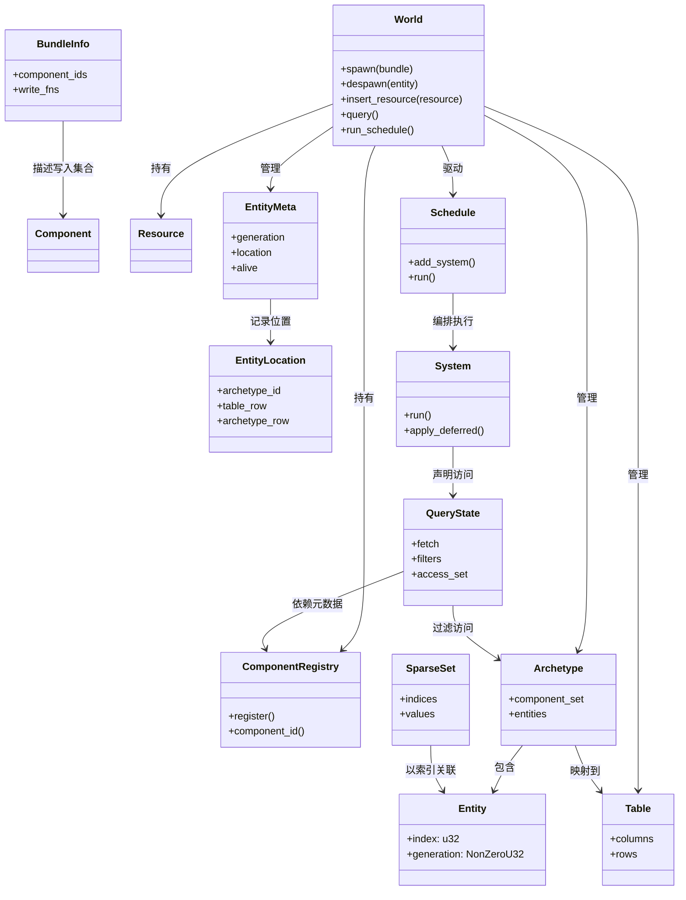

# ECS 范式与问题域

导航：
- [第一层索引](/e:/RustProject/Learn-Bevy-ECS/Docs/ECS-Learning/01-Macro-Overview/README.md)
- [第二层模块设计](/e:/RustProject/Learn-Bevy-ECS/Docs/ECS-Learning/02-Module-Design/README.md)

## ECS 到底在解决什么

ECS 不是一种“换个写法的 OOP”，它真正解决的是运行时数据组织问题。传统面向对象模型倾向于把一类对象的行为和状态打包在一起，但在高频遍历、批量更新、并行执行和缓存友好访问上，这种布局往往不理想。ECS 通过把“身份”“数据”“行为”“调度”拆开，让程序更容易做下面几件事：

- 用稳定的实体标识表示世界中的“对象存在性”。
- 用细粒度组件表达状态，而不是让一个大对象承担所有字段。
- 用查询系统按数据模式批量遍历对象。
- 用调度器根据读写冲突分析自动并行。
- 用统一的 World 容器承载资源、实体和生命周期事件。

## ECS 的四个基本视角

### 1. 身份视角

实体只是一个 ID，不应该天然携带行为。它的职责是作为组件集合的宿主，以及跨系统引用的锚点。

### 2. 数据视角

组件应该是纯数据，尽量避免把复杂流程直接塞进组件方法里。组件的设计质量直接决定：

- 查询粒度是否合理
- 存储布局是否稳定
- 并行冲突是否容易分析
- 变更检测是否准确

### 3. 行为视角

System 是一段对 World 子集进行读取或写入的逻辑单元。System 本身不关心“世界里有哪些类”，只关心“有哪些数据模式”。

### 4. 运行时视角

真正困难的部分不在于写出 `Position` 和 `Velocity`，而在于让 ECS 运行时长期维持这些约束：

- 实体 ID 不悬空
- 组件元数据全局一致
- Archetype 迁移不破坏存储一致性
- Query 访问不会违反 Rust 的借用规则
- Schedule 能识别冲突、维持顺序并尽可能并行

## 你在实现自己的 ECS 时最容易误判的地方

### 误判一：把 ECS 当成 HashMap 套壳

如果只做 `HashMap<Entity, HashMap<TypeId, Box<dyn Any>>>`，你可以快速得到一个“能跑”的 ECS，但它基本无法回答以下问题：

- 怎么做高效批量遍历？
- 怎么做缓存友好的同构组件扫描？
- 怎么做并行冲突分析？
- 怎么做组件添加/删除时的布局迁移？

### 误判二：把 Query 理解成语法糖

Query 不是“好看的 API”，而是 ECS 的核心编译步骤。它要把“我要读什么、写什么、过滤什么”编译成一套可重复执行的访问计划。

### 误判三：把 Schedule 理解成系统列表

真正的调度器不是按顺序 for-loop 调函数。它需要考虑：

- 系统读写集合
- before / after 依赖
- set 级别约束
- run condition
- deferred command 的刷新时机
- 歧义检测与诊断

## 你需要建立的完整心智模型

一套可用 ECS 至少同时包含以下层面：

- 标识层：Entity 与 generation
- 元数据层：ComponentId、BundleId、StorageType、Required Components
- 存储层：Tables、SparseSets、Resources、Archetypes
- 访问层：World、EntityRef、UnsafeWorldCell、QueryState
- 行为层：System、SystemParam、Commands、Events
- 调度层：Schedule、Executor、Graph、Conditions
- 诊断层：变更检测、冲突检测、追踪与测试

## ECS 结构类图

## 我们这套学习文档的核心原则

- 不先追求“像 Bevy 一样大”，先追求“像运行时系统一样完整”。
- 不先追求宏和语法糖，先把数据结构与不变量立住。
- 每实现一个子模块，都必须回答它与其他模块的接口边界。
- 每个阶段都要求可测试、可验证、可回归。

## 下一步

- 看 [运行时架构全景](/e:/RustProject/Learn-Bevy-ECS/Docs/ECS-Learning/01-Macro-Overview/02-runtime-architecture.md)，把 ECS 看成运行中的数据流。
