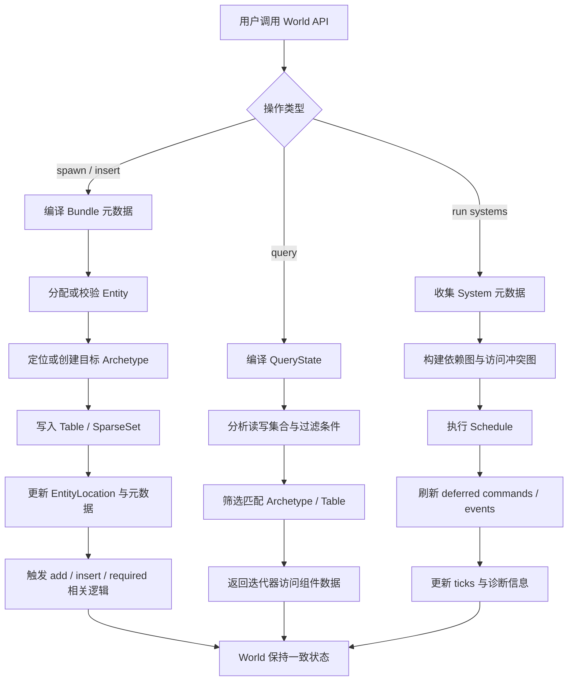

# 运行时架构全景

导航：
- [第一层索引](/e:/RustProject/Learn-Bevy-ECS/Docs/ECS-Learning/01-Macro-Overview/README.md)
- [Bevy 参考映射](/e:/RustProject/Learn-Bevy-ECS/Docs/ECS-Learning/01-Macro-Overview/03-bevy-reference-map.md)

## ECS 运行时最小闭环

一套完整的 ECS 运行时至少要能完成这个闭环：

1. 创建 World
2. 注册组件元数据
3. 分配 Entity
4. 把 Bundle 写入正确的存储布局
5. 通过 Query 和 System 读取/写入数据
6. 通过 Schedule 执行多个 System
7. 处理命令延迟、事件传播、变更检测
8. 安全地移除组件、回收实体并维护一致性

## ECS 运行流程图

## 建议把 ECS 拆成六个运行时核心

### 核心一：身份与元数据核心

负责实体 ID、generation、组件注册、Bundle 描述、Required Components 等“全局定义信息”。

### 核心二：存储与布局核心

负责 Table、SparseSet、Archetype、组件迁移、批量插入与删除。

### 核心三：World 外观核心

负责向外暴露统一 API，把实体、组件、资源、命令队列、观察者等系统组织到一个世界对象中。

### 核心四：访问分析核心

负责 Query 编译、访问集合、过滤器、缓存、变更检测和 removed tracking。

### 核心五：行为抽象核心

负责把函数包装成 System，解析 SystemParam，支持 Commands、Events、Observers 等行为注入点。

### 核心六：调度与执行核心

负责把 System 组成执行图，分析依赖与冲突，选择执行策略并产出诊断信息。

## 运行中的数据流

### Spawn 路径

- 用户提交一个 Bundle
- ECS 查询该 Bundle 对应的组件集合
- 找到或创建目标 Archetype
- 给 Entity 分配位置
- 把表存储组件写入 Table，把稀疏组件写入 SparseSet
- 更新实体位置元数据
- 触发 add / insert 相关生命周期逻辑

### Query 路径

- Query 根据访问类型构建 QueryState
- QueryState 收集读写组件与过滤条件
- 运行时按 Archetype / Table 过滤候选集合
- 迭代器返回匹配数据，并维持借用安全

### Schedule 路径

- 收集系统元数据
- 计算每个系统的访问集与依赖边
- 构建系统图
- 选择执行器
- 在运行过程中插入 ApplyDeferred 边界
- 汇总诊断信息和变更 tick

## 关键不变量

### Entity 不变量

- 活着的实体必须能映射到一个有效位置。
- 已回收的实体 generation 必须变化，防止旧句柄误用。

### Storage 不变量

- Table 行与 Archetype 中的实体顺序必须保持一致或可映射。
- SparseSet 中实体索引与组件值必须同步更新。

### Query 不变量

- 不能同时向两个系统暴露违反 Rust 借用规则的访问。
- Query 编译产物必须和当前组件注册表兼容。

### Schedule 不变量

- 显式顺序约束必须生效。
- 不兼容访问不能被并行执行。
- deferred command 的应用边界必须明确。

## 我们的实现策略

为了学习效率，我们不会一次把所有高级功能同时写出来，而是采用“自底向上、每层可运行”的方式：

- 先做单线程、最小可用 World
- 再做 Archetype 与 Query
- 再做 System 与 Schedule
- 最后做 change detection、events、observers、diagnostics

## Bevy 对照入口

- World：[`world/mod.rs`](/e:/RustProgram/Bevy/bevy-0.18/crates/bevy_ecs/src/world/mod.rs)
- Schedule：[`schedule/mod.rs`](/e:/RustProgram/Bevy/bevy-0.18/crates/bevy_ecs/src/schedule/mod.rs)
- System：[`system/mod.rs`](/e:/RustProgram/Bevy/bevy-0.18/crates/bevy_ecs/src/system/mod.rs)

## 下一步

- 看 [Bevy 参考映射](/e:/RustProject/Learn-Bevy-ECS/Docs/ECS-Learning/01-Macro-Overview/03-bevy-reference-map.md)，明确哪些源码目录会对应到我们的哪些学习模块。
